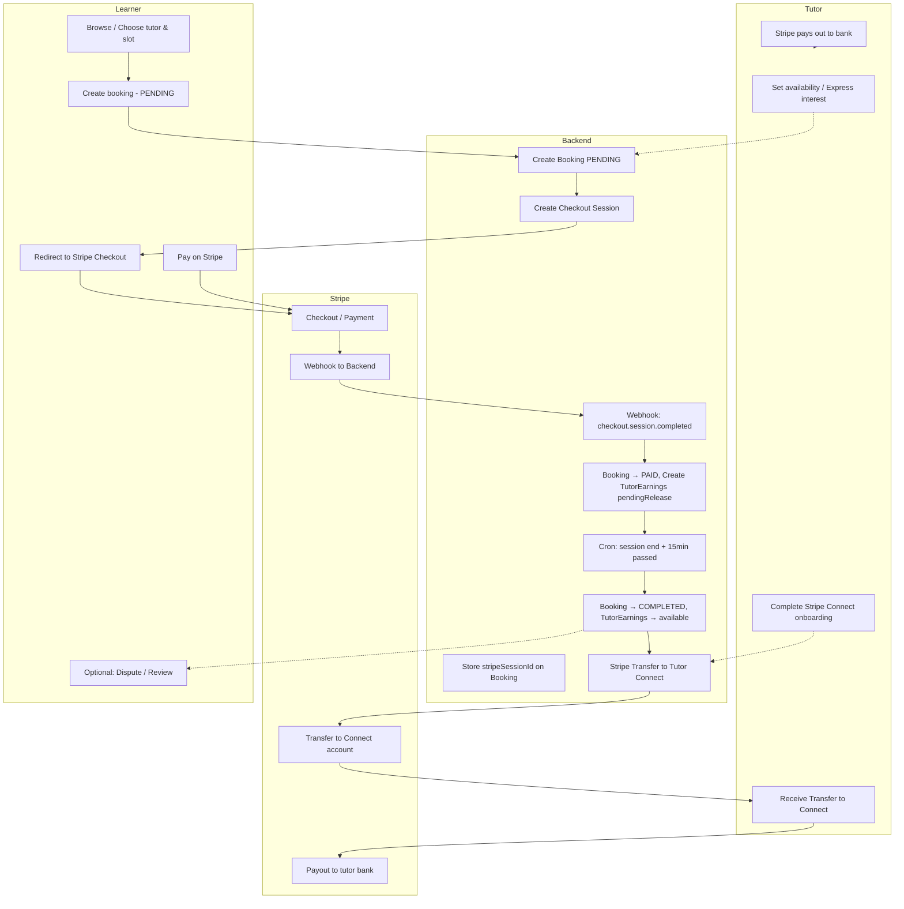
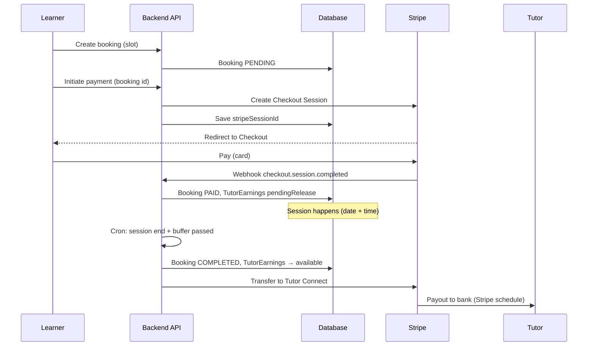

# Booking, Payment & Withdrawal – End-to-End Flow

This document describes the full flow from learner booking and payment through tutor earnings and payout, including disputes and platform behaviour.

---

## 1. Learner scenario

| Step | Actor | Action | System / DB |
|------|--------|--------|-------------|
| 1 | Learner | Browses tutors, selects tutor and slot (or responds to a tuition request with a chosen tutor). | — |
| 2 | Learner | Creates booking (date, startTime, endTime; optional `requestId` for negotiated rate). | **Booking** created with `status: PENDING`. `agreedHourlyRate` = tutor rate or request budget. Slot uniqueness enforced (no double-book). |
| 3 | Learner | Clicks “Pay” → backend creates Stripe Checkout Session. | **Booking** gets `stripeSessionId`, `stripePaymentIntentId`; learner is redirected to Stripe-hosted checkout. |
| 4 | Learner | Completes payment on Stripe (card). | Stripe charges the card. **Backend does not** mark PAID here. |
| 5 | Stripe | Sends webhook `checkout.session.completed` (or `payment_intent.succeeded`) to backend. | Backend finds booking by `stripeSessionId` (or `stripePaymentIntentId`), marks **Booking** `status: PAID`, creates **TutorEarnings** (one per booking) with `status: pendingRelease`, closes linked **TuitionRequest** if any. |
| 6 | Learner | Sees “payment successful” (redirect from Stripe). | Booking is now PAID; learner and tutor can use chat (booking-scoped). |
| 7 | — | Session takes place (date + startTime–endTime). | No automatic status change yet. |
| 8 | Backend (cron) | Every 5 minutes: for each **PAID** booking where session end + 15 min buffer has passed, marks booking **COMPLETED** and releases tutor earnings. | **Booking** `status: COMPLETED`. **TutorEarnings** for that booking: `pendingRelease` → `available`. Platform creates **Stripe Transfer** to tutor’s Connect account (if onboarding complete). |
| 9 (optional) | Learner | Can raise a **dispute** within 24 hours of session end. | **Dispute** created (OPEN). Earnings stay in escrow until resolution. |
| 10 (optional) | Admin | Resolves dispute: FULL_REFUND / PARTIAL_REFUND / RELEASE_PAYMENT_TO_TUTOR. | Refund via Stripe if applicable; TutorEarnings updated (refunded or released) accordingly. |
| 11 (optional) | Learner | Can submit a **review** once booking is COMPLETED and paid. | **Review** stored; one per booking. |

**Important:** The booking is only marked PAID when the **Stripe webhook** is received and processed. The frontend success redirect is not used to update the DB. For local development, use Stripe CLI to forward webhooks to `localhost`.

---

## 2. Tutor scenario

| Step | Actor | Action | System / DB |
|------|--------|--------|-------------|
| 1 | Tutor | Completes profile, sets **availability** (slots). | **Availability** (and **Tutor** profile) stored. |
| 2 | Tutor | (If using requests) Expresses **interest** on a learner’s tuition request. | **TutorInterest** created. Learner can then create a booking for that tutor with request’s budget. |
| 3 | — | Learner creates and pays for a booking (see learner flow). | **Booking** PAID; **TutorEarnings** entry created with `status: pendingRelease`. |
| 4 | Tutor | Sees upcoming session in dashboard; can use chat with learner. | — |
| 5 | — | Session happens; cron marks booking COMPLETED and releases earnings (see above). | **TutorEarnings** for that booking: `pendingRelease` → `available`. If tutor has completed **Stripe Connect** onboarding, a **Stripe Transfer** is created to the tutor’s Connect account (platform balance → Connect balance). |
| 6 | Tutor | **Payout setup (before or after sessions):** Clicks “Complete Payout Setup” → backend creates Stripe Connect Express account (if needed) and **Account Link**. | Tutor redirected to Stripe to complete identity/bank details. **Tutor** gets `stripeAccountId`; `stripeOnboardingStatus` = PENDING. |
| 7 | Stripe | Sends `account.updated` webhook when tutor completes onboarding. | Backend updates **Tutor**: `chargesEnabled`, `payoutsEnabled`, `stripeOnboardingStatus` (e.g. COMPLETED). |
| 8 | Tutor | Views **Wallet**: pending (escrow) vs available (released). | **GET /api/tutor/wallet**: `pendingEarnings` = sum of TutorEarnings `pendingRelease`; `availableEarnings` = sum of TutorEarnings `available`. |
| 9 | Platform / Stripe | When earnings become **available**, backend creates a **Transfer** to the tutor’s Connect account (same step as cron release). | Money moves from platform Stripe balance to tutor’s Connect account. **TutorEarnings** entry gets `stripeTransferId`. |
| 10 | Stripe | Pays out from Connect account to tutor’s bank (Stripe’s schedule, e.g. 2-day rolling). | No extra action in our app; tutor receives funds in bank. |

**Withdrawal:** There is no separate “withdraw” button. Once a session is completed and the cron has run (and no open dispute), earnings move: **pendingRelease** → **available** and a **Stripe Transfer** is created to the tutor’s Connect account. Stripe then pays out to the tutor’s bank. If the tutor has not completed Connect onboarding, the ledger still shows **available** but no transfer is created until they complete setup.

---

## 3. Money and status summary

- **Booking statuses:** `PENDING` → `PAID` (via webhook) → `COMPLETED` (via cron after session end + buffer). Other: `FAILED`, `CANCELLED`, `NO_SHOW`.
- **TutorEarnings statuses:** `pendingRelease` (escrow) → `available` (released; transfer created if tutor has Connect). Optional: `refunded` (e.g. after FULL_REFUND dispute).
- **Commission:** Stored in **TutorEarnings** as `commissionInPaise` at payment time. Transfer to tutor = booking amount − commission (in paise).
- **Disputes:** Learner can open within 24h of session end. While **OPEN**, earnings are not released. Admin resolution determines refund and/or release to tutor.

---

## 4. High-level diagram

---

## 5. Sequence (simplified)

---

## 6. Key endpoints and triggers

| What | How |
|------|-----|
| Create booking | `POST /api/bookings` (learner; slot + optional requestId) |
| Start payment | `POST /api/bookings/:id/pay` → returns Stripe Checkout URL |
| Mark PAID | Stripe webhook `POST /api/webhooks/stripe` (event `checkout.session.completed` or `payment_intent.succeeded`) |
| Mark COMPLETED + release earnings | Backend cron every 5 min (`completeEligibleBookings`) |
| Tutor wallet | `GET /api/tutor/wallet` (pendingEarnings, availableEarnings, entries) |
| Tutor payout setup | `POST /api/tutor/payout-setup` → redirect to Stripe Connect onboarding |
| Dispute | `POST /api/learner/bookings/:bookingId/dispute`; resolution via admin (FULL_REFUND / PARTIAL_REFUND / RELEASE_PAYMENT_TO_TUTOR) |

All amounts in the ledger and transfers use **paise** (or smallest currency unit) where applicable; display in pounds as needed in the frontend.
